# 01 - Hello World

## Tujuan Pembelajaran

1. (bisa copy dari RPS kolom sub-CP-MK)
2. dst

## Hasil Praktikum

## 1.
Buka Android Studio, lalu pilih Empty Activity, klik Next

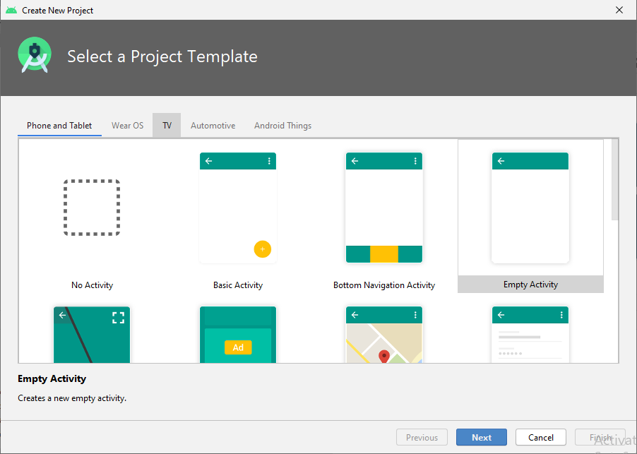

## 2. 
Setelah itu akan tampil menu Configure Your Project , isi dengan ketentuan yg kita inginkan lalu klik Finish

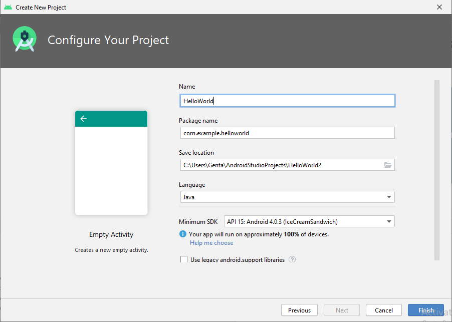

- Beri nama project

  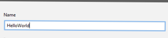

- Pilih tempat menyimpan project

  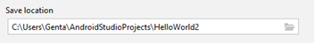

- Memilih Bahasa pemrograman, berisi dua Bahasa yaitu : Java & Kotlin

  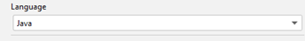

- Memilih minimum SDK

  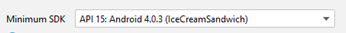

## 3. 
Lalu muncul halaman Main Activity.java , ini adalah halaman untuk melihat hasil tampilan pada aplikasi

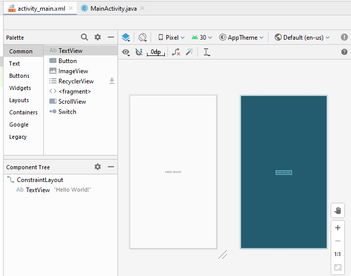

## 4.
Disebelah MainActivity.java ada activity_main.xml , disini adalah halaman untuk membuat code pada aplikasi

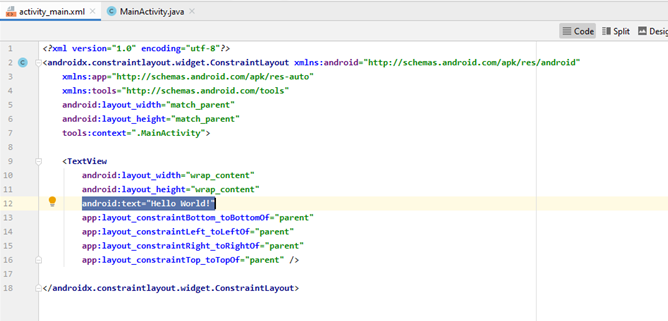

- **android:text="Hello World!"** digunakan untuk membuat teks/paragraf

  

## 5.

Ini adalah navigasi untuk tools yang ada di android studio

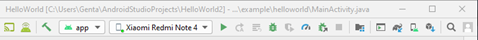

- Ini adalah Plugin untuk meng deploy aplikasi ke perangkat HP kita menggunakan koneksi wifi

  

- Jika perangkat hp terdeteksi maka akan tampil jenis hp kita, setalah itu klik tombol play hijau untuk menjalankan deploy

  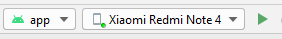

## 6.

Jika berhasil di deploy maka di HP akan muncul aplikasi yang kita buat

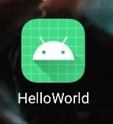

