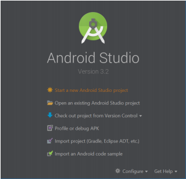
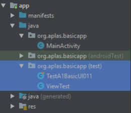
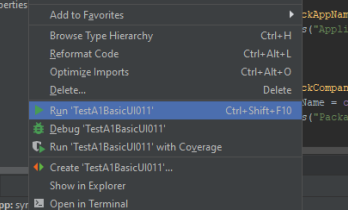
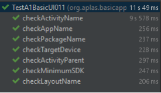

# 02 - Layout ( A1X01 )

## Tujuan Pembelajaran

1. Siswa tahu cara memulai Proyek Android Studio dengan blank layout.

## Hasil Praktikum 

## 1.
Buat **New Project** Android Studio

Selanjutnya Sesuaikan Spesifikasi Project Seperti di Bawah.

a) Pilih "Empty Activity"\
b) Name: BasicAppX\
c) Package name: org.aplas.basicappx\
d) Save Location: apa saja\
e) Language: Java\
f) Minimum API Level: API 21 / Android 5.0 Lollipop

## 2.
Ubah konten file “build.gradle (Module: app)” seperti di bawah ini, lalu Sync

     apply plugin: 'com.android.application'

    android {
        compileSdkVersion 28
        testOptions.unitTests.includeAndroidResources = true
        defaultConfig {
            applicationId "org.aplas.basicappx"
            minSdkVersion 21
            targetSdkVersion 28
            versionCode 1
            versionName "1.0"
            buildConfigField "int", "MIN_SDK_VERSION", "$minSdkVersion.apiLevel"
            buildConfigField "int", "TARGET_SDK_VERSION", "$targetSdkVersion.apiLevel"
            testInstrumentationRunner "androidx.test.runner.AndroidJUnitRunner"
        }
        buildTypes {
            release {
                minifyEnabled false
                proguardFiles getDefaultProguardFile('proguard-android-optimize.txt'),
                'proguard-rules.pro'
            }
        }
    }
    dependencies {
        implementation fileTree(dir: 'libs', include: ['*.jar'])
        implementation 'androidx.appcompat:appcompat:1.1.0'
        implementation 'androidx.constraintlayout:constraintlayout:1.1.3'
        testImplementation 'junit:junit:4.12'
        testImplementation "org.robolectric:robolectric:4.2.1"
        androidTestImplementation 'androidx.test:runner:1.2.0'
    }

## 3. 
Hapus "ExampleUnitTest" di folder "org.aplas.basicapp (test)".

Lalu copy file "TestA1BasicUI011X.java" dan "ViewTest.java" ke "org.aplas.basicappx
(test) ”\\

## 4.
Klik kanan pada file “TestA1BasicUIX011.java” lalu pilih Run ‘TestA1BasicUIX011’ dan klik..

## 5. 
Jika berhasil lanjutkan ke langkah berikutnya 

