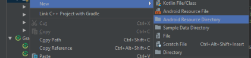
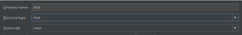
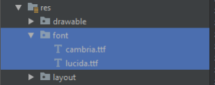
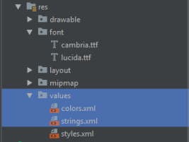
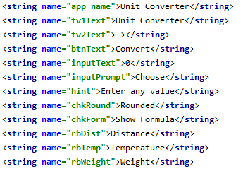
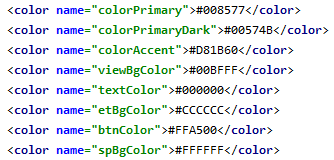
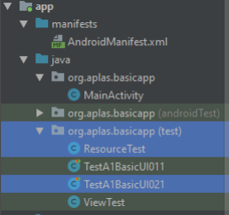
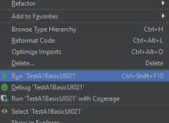
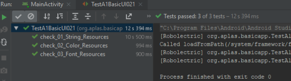

# 02 - Layout ( A1X02 )

## Tujuan Pembelajaran

1. Siswa tahu cara mengonfigurasi Android Studio project resources, seperti
string dan font

## Hasil Praktikum 

## 1.
Buka BasicAppX Project
Buat folder "font" di bawah folder "res". Klik kanan pada folder "res" dan pilih
“New –Adroid Resource Directory”

Kemudian pilih "New Resource Director", dan pilih Resource typea: "font", lalu Klik "OK".

## 2. 
Salin file “cambria.ttf” dan “lucida.ttf” di folder Supplement ke folder “font” yang
sudah dibuat sebelumnya.

## 3.
Buka file **strings.xml** di bawah folder **res values**

## 4. 
Edit semua nilai nama "string" seperti di bawah ini.

## 5. 
Buka file **colors.xml** di bawah folder **res / values** dan edit nilai **color** seperti di bawah ini

## 6. 
Copy file **TestA1BasicUIX021.java** dan **ResourceTest.java** ke
Folder **org.aplas.basicappx (test)**

## 7. 
Klik kanan pada file **TestA1BasicUIX021.java** lalu pilih **Run TestA1BasicUIX021** dan klik.

## 8. 
Jika berhasil lanjutkan ke langkah berikutnya 

