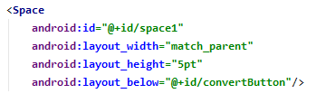

# 02 - Layout ( A1X04 )

## Tujuan Pembelajaran

1. (bisa copy dari RPS kolom sub-CP-MK)
2. dst

## Hasil Praktikum 

## 1.
Buka BasicAppX Project,lalu 
buka file **activity_main.xml** di layout resource.

## 2. 
Pada layout xml editor, buat "Spasi" dengan id "spasi" mengacu pada
spesifikasi di bawah.

## 3.
Di bawah Spasi, tambahkan LinearLayout sebagai child layout dengan id **child1**
seperti di bawah.

## 4. 
Tampilan UI nya akan seperti ini

## 5. 
Copy file **TestA1BasicUIX041.java** ke folder **org.aplas.basicapp (test)**

## 6. 
Klik kanan pada file **TestA1BasicUIX041.java** lalu pilih **Run TestA1BasicUIX041** dan klik.

## 7. 
Jika berhasil lanjutkan ke langkah berikutnya 

