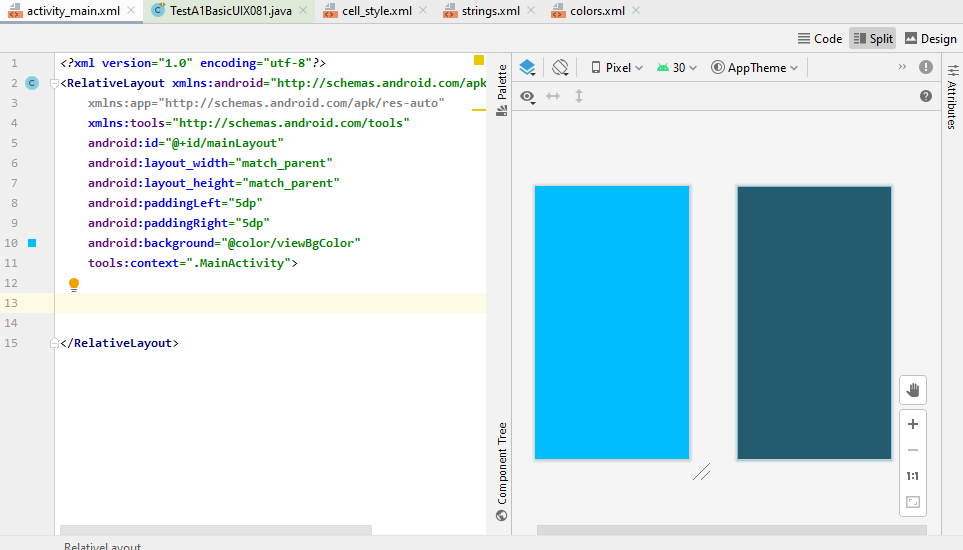
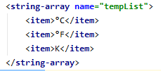
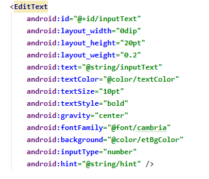
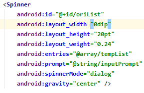
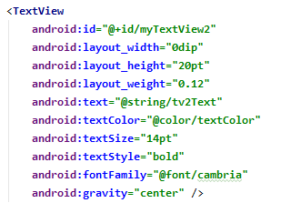
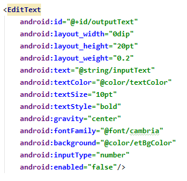
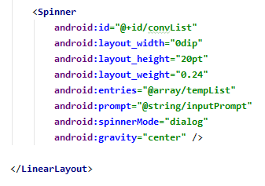
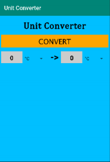
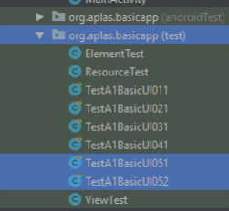
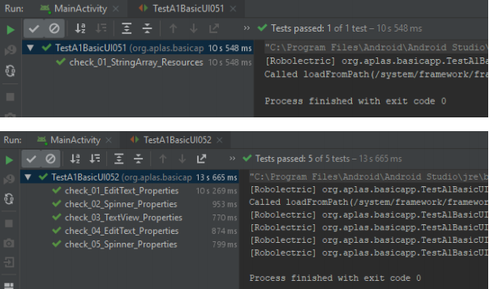

# 02 - Layout ( A1X05 )

## Tujuan Pembelajaran

1. (bisa copy dari RPS kolom sub-CP-MK)
2. dst

## Hasil Praktikum 

## 1.
Buka BasicAppX Project,lalu 
Buka file **strings.xml** di bawah folder **res / values**

## 2. 
Tambahkan **string-array** seperti di bawah

## 3.
Buka file **activity_layout.xml**

## 4. 
Dalam tag **child1** LinearLayout, tambahkan **EditText** dengan id "inputText"
seperti di bawah.

## 5. 
Di bawah **EditText**, tambahkan **Spinner** dengan id **oriList** seperti dibawah.

## 6. 
Di bawah **Spinner**, tambahkan **TextView** dengan id **myTextView2** seperti dibawah

## 7. 
Di bawah **TextView**, tambahkan **EditText** dengan id **outputText** seperti dibawah

## 8. 
Di bawah **EditText**, tambahkan **Spinner** dengan id **convList** dibawah

## 9. 
Tampilan UI nya seperti di bawah

## 10. 
Copy file **TestA1BasicUIX051.java** dan **TestA1BasicUIX052.java** ke
Folder **org.aplas.basicapp (test)**.

## 11. 
Klik kanan pada file **TestA1BasicUIX051.java** lalu pilih **Run TestA1BasicUIX051** dan **TestA1BasicUIX052.java** lalu Jika berhasil lanjutkan ke langkah berikutnya 

