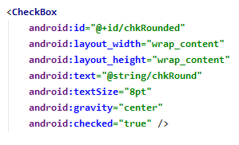
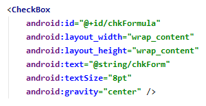
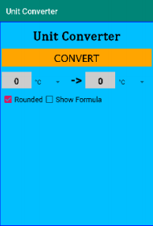
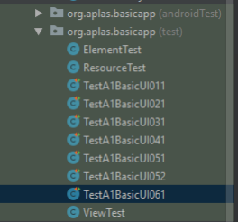
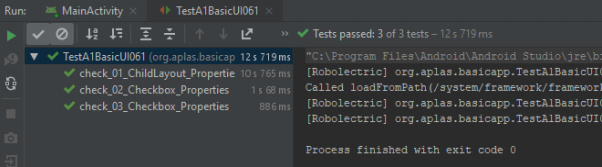

# 02 - Layout ( A1X06 )

## Tujuan Pembelajaran

1. Siswa tahu cara membuat Checkbox

## Hasil Praktikum 

## 1.
Buka BasicAppX Project,lalu 
buka file **activity_main.xml** di layout resource.

## 2. 
Di bawah LinearLayout **child1**, buat LinearLayout dengan id **child2** seperti di bawah

## 3.
Di tag **child2**, tambahkan Kotak Centang dengan id **chkRounded**
di bawah.

## 4. 
Di bawah Checkbox **chkRounded**, tambahkan Checkbox dengan id **chkFormula**

## 5. 
Tampilan UI nya seperti dibawah.

## 6. 
Copy file **TestA1BasicUIX061.java** ke Folder **org.aplas.basicapp (test)**.

## 7. 
Klik kanan pada file **TestA1BasicUIX061.java** lalu pilih **Run TestA1BasicUIX061** lalu Jika berhasil lanjutkan ke langkah berikutnya 

