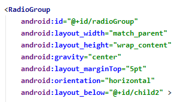
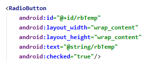
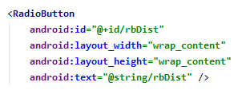
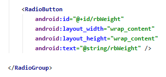
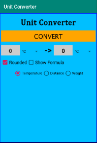
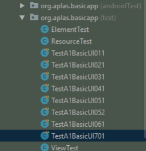
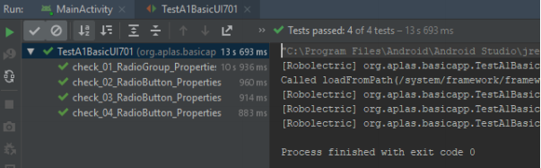

# 02 - Layout ( A1X07 )

## Tujuan Pembelajaran

1. Siswa tahu bagaimana membuat RadioGroup dan RadioButton

## Hasil Praktikum 

## 1.
Buka BasicAppX Project,lalu 
buka file **activity_main.xml** di layout resource.

## 2. 
Di bawah LinearLayout **child2**, buat **RadioGroup** dengan id **radioGroup**

## 3.
Di tag **radioGroup**, tambahkan 3 RadioButton (s) dengan id **rbTemp**, **rbDist**, dan **RbWeight**

* Radio Button 1

* Radio Button 2

* Radio Button 3

## 4. 
Tampilan UI nya seperti di bawah

## 5. 
Copy file **TestA1BasicUIX071.java** ke Folder **org.aplas.basicapp (test)**.

## 7. 
Klik kanan pada file **TestA1BasicUIX071.java** lalu pilih **Run TestA1BasicUIX071** lalu Jika berhasil lanjutkan ke langkah berikutnya 

