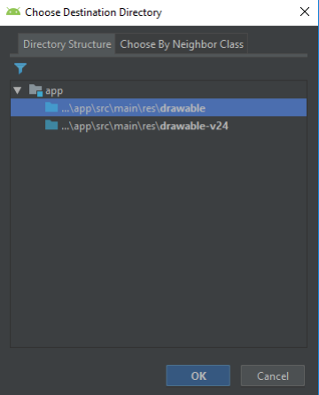
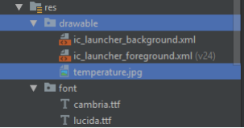
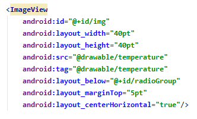
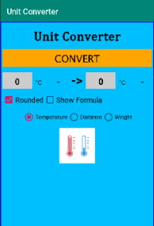
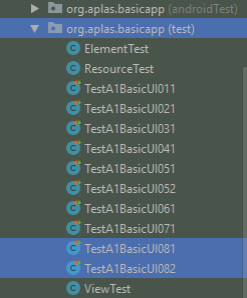
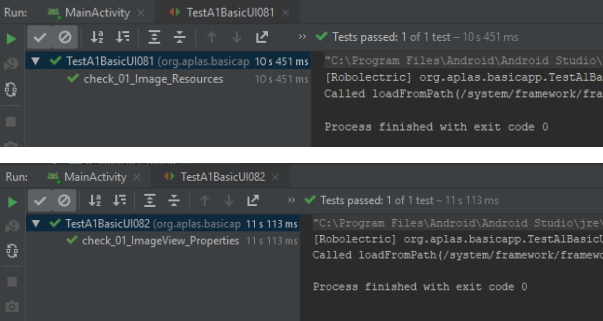

# 02 - Layout ( A1X08 )

## Tujuan Pembelajaran

1. (bisa copy dari RPS kolom sub-CP-MK)
2. dst

## Hasil Praktikum 

## 1.
Buka BasicAppX Project,lalu 

## 2. 
Salin file **temperature.jpg** di folder Supplement ke folder **drawable** di bawah **res** folder

* Pilih "drawable", klik OK

## 3.
buka file **activity_main.xml** di layout resource.

## 4. 
Di bawah **RadioGroup**, buat **ImageView** dengan id **img**

## 5. 
Tampilan UI nya seperti di bawah

## 7. 
Copy file **TestA1BasicUIX081.java** dan **TestA1BasicUIX082.java** ke
Folder **org.aplas.basicapp (test)**.

## 8. 
Klik kanan pada file **TestA1BasicUIX081.java** lalu pilih **Run TestA1BasicUIX081** dan **TestA1BasicUIX082.java** lalu Jika berhasil lanjutkan ke langkah berikutnya 

