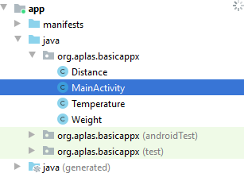

# 02 - Layout ( B1X05 )

## Tujuan Pembelajaran

1. Siswa tahu cara mengonfigurasi color resources, membuat EditText, dan
Spinner.

## Hasil Praktikum 

## 1.
Buka **BasicAppX** Project, lalu 
buka **MainActivity.java**.

    @Override
    protected void onCreate(Bundle savedInstanceState) {
        super.onCreate(savedInstanceState);
        …
        …
    }

## 2. 
Pastikan metode **"onCreate"** sudah ditulis.
Dalam metode **"onCreate"**, tulis kode untuk memuat **"activity_layout"** yang terletak di layout resource.

contoh :

    setContentView(R.layout.layout_name)

## 3.
Di bawah sintaks nomor 4, tetapkan setiap field dari layout element yang ditentukan dalam
tugas 2.01.04 dengan resource di acivity.

contoh :

    field_name = (datatype)findViewById(R.id.resource_name);

Ada 9 field yang dijelaskan di bawah ini:

## 4. 
Buat method **"onStart"** di bawah method **"onCreate"** seperti di bawah ini.
Untuk menampilkan dialog saat aplikasi dimulai:
- Di bawah kelas **MainActivity**, buat private field dengan nama **"startDialog"**
dan tipe data AlertDialog.
- Buat metode **"onStart"** seperti di bawah ini:

        @Override
        protected void onStart() {
            super.onStart();
            …
            …
        }

- Dalam method **"onStart"**, tentukan dialog seperti berikut:

        startDialog = new AlertDialog.Builder(MyActivity.this).create();
        startDialog.setTitle("Application started");
        startDialog.setMessage("This app can use to convert any units");
        startDialog.setButton(AlertDialog.BUTTON_NEUTRAL, "OK",
            new DialogInterface.OnClickListener() {
                public void onClick(DialogInterface dialog, int which) {
                    dialog.dismiss();
                }
            });

- Kemudian tunjukkan dialog dengan method **“show”**.

    

## 5. 
Copy **TestA1BasicUIX051.java** ke folder
**org.aplas.basicappx (test)**

## 6. 
Klik kanan pada file **TestB1BasicActivityX051.java** lalu pilih **Run TestB1BasicUIX051**. Jika berhasil lanjutkan ke langkah berikutnya . 

