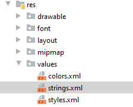
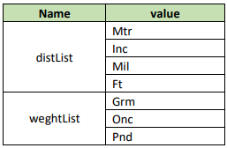
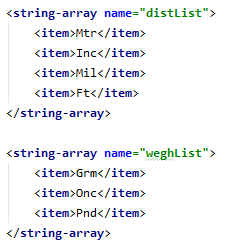
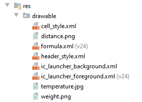
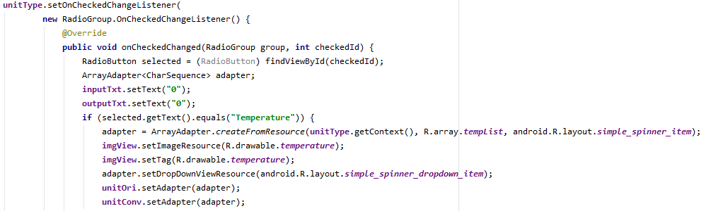
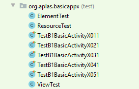
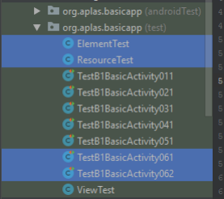
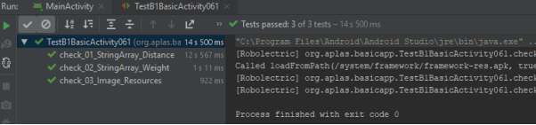
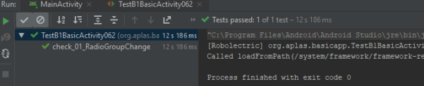

# 02 - Layout ( B1X06 )

## Tujuan Pembelajaran

1. Siswa memahami tentang mengubah event RadioGroup dan bagaimana caranya
mengubah konten Spinner.

## Hasil Praktikum 

## 1.
Buka BasicAppX Project,lalu 
Buka file **"strings.xml"** di bawah folder "res / values"

## 2. 
Tambahkan nilai dari semua nama **"string-array"** seperti yang dijelaskan dalam table di bawah.

## 3.
Copy file **"distance.png"** dan **"weight.png"** di folder Supplement ke **"drawable"**
folder di bawah folder **"res"**

## 4. 
Buka **MainActivity.java** dan buat event saat **"unitType"** **Radiogroup** ada di dalam
method **onCreate**.

Code untuk membuat event **Radiogroup** berubah:

    unitType.setOnCheckedChangeListener(
    new RadioGroup.OnCheckedChangeListener() {
        @Override
            public void onCheckedChanged(RadioGroup group, int checkedId) {
            …
            …
            }
    });

## 5. 
Tulis kode dalam metode onCheckedChanged.
- Buat variabel RadioButton dan tetapkan dengan RadioButton yang dipilih
RadioGroup.
Dipilih RadioButton => (RadioButton) findViewById (checkId);
- Definisikan variabel ArrayAdapter <CharSequence> untuk menampung sumber daya stringarray.
- Tetapkan adaptor dengan nilai dari sumber daya string-array yang dipilih
tombol radio.
ArrayAdapter.createFromResource (unitType.getContext (),
R.array.arraylistname, android.R.layout.simple_spinner_item);
- Set gambar imgView dengan sumber gambar baru tergantung pada yang dipilih
tombol radio.
imgView.setImageResource (R.drawable.imageresourcename);
- Atur gaya adaptor.
adaptervarname.setDropDownViewResource (android.R.layout.simple_spinner_dropdown_
barang);
- Setel konten unitOri dan unitConv dengan adaptor.
unitOri.setAdapter (adaptor);
unitConv.setAdapter (adaptor);
- Atur teks inputText dan outputText dengan “0”;

  

## 6.
Copy file **"ElementTest.java"** dan **"ResourceTest.java"** ke **"org.aplas.basicappx(test) ”**.

## 7. 
Copy file **TestB1BasicUIX061.java** dan **TestB1BasicUIX062.java** ke Folder **org.aplas.basicapp (test)**.

## 8. 
Klik kanan pada file **TestA1BasicUIX061.java** lalu pilih **Run TestA1BasicUIX061**

Setelah itu Klik kanan pada file **TestA1BasicUIX062.java** lalu pilih **Run TestA1BasicUIX062**
 lalu Jika berhasil lanjutkan ke langkah berikutnya 

