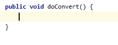
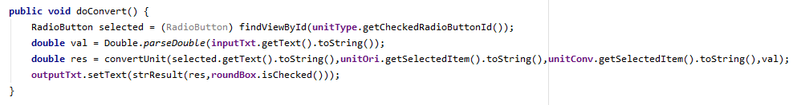
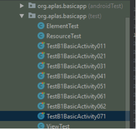
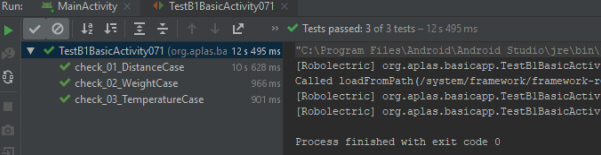

# 02 - Layout ( B1X07 )

## Tujuan Pembelajaran

1. Siswa tahu bagaimana membuat RadioGroup dan RadioButton

## Hasil Praktikum 

## 1.
Buka **BasicAppX** Project,lalu 
Buka **MainActivity.java** dan buat methd void baru dengan nama **"doConvert"**

## 2. 
Buat algoritme untuk mengonversi nilai dari inputTxt dan memasukkan hasilnya ke
outputTxt bergantung pada unit yang dipilih di oriList dan convList.
- Gunakan metode convertUnit untuk mengkonversi dan mendapatkan nilai ganda.
- Gunakan kode ini untuk memilih RadioButton dari RadioGroup
RadioButton varName = (RadioButton)
findViewById (radioButtonName.getCheckedRadioButtonId ());
- Gunakan metode “Double.parseDouble” untuk mengubah dari string menjadi double.
- Gunakan metode strResult untuk mengubah nilai hasil dari double menjadi string dependen
di roundBox.
- Gunakan kode ini untuk mendapatkan nilai kotak centang Boolean.
checkBoxName.isChecked ();
- Atur teks outputTxt dengan hasil string.

## 3. 
Copy file **TestB1BasicUIX071.java** ke Folder **org.aplas.basicapp (test)**.

## 4. 
Klik kanan pada file **TestB1BasicUIX071.java** lalu pilih **Run TestB1BasicUIX071** lalu Jika berhasil lanjutkan ke langkah berikutnya 

