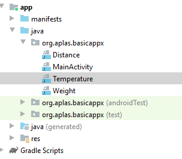
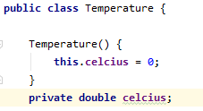
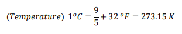
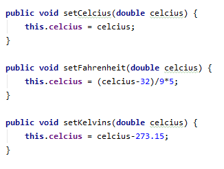
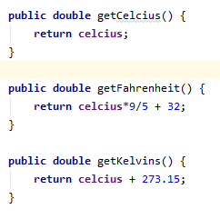
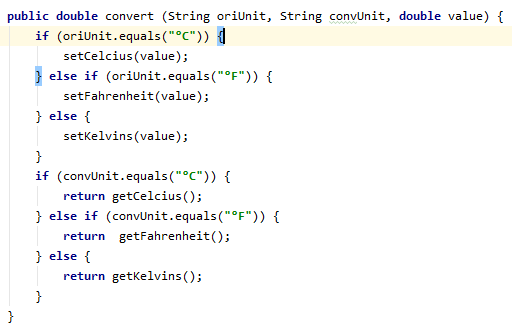
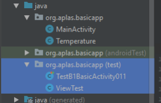
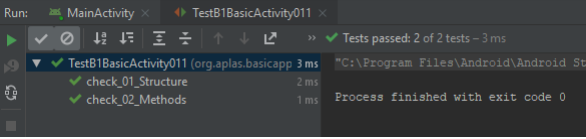

# 03 - Basic_Activity ( A1X01 )

## Tujuan Pembelajaran

1. Siswa membuat Temperature class untuk mengonversi satuan.

## Hasil Praktikum 

## 1.
Buka proyek BasicUIX (BasicAppX) yang telah lulus uji.
Hapus semua file di folder **"org.aplas.basicappx (test)"**.
Buat Temperature class baru, terletak di folder yang sama dengan **MainActivity**.

## 2.
Buat private field dengan nama **“celcius”** dan tipe data double.
Lalu buat konstruktor dengan parameter kosong. Inisialisasi konstruktor
**“Celcius”** dengan nilai 0.

## 3. 
Buat tiga set Method untuk **"celcius"** dengan mengacu pada rumus ini :

- **“SetCelcius”**, dengan 1 double parameter yang langsung ditetapkan ke field **“celsius”**.
- **“setFahrenheit”**, dengan 1 double parameter yang akan mengkonversi dari **° F** ke **° C** dan
tetapkan hasilnya ke kolom **"celcius"**.
- **“setKelvin”**, dengan 1 double parameter yang akan dikonversi dari **K** ke **° C** dan ditetapkan
hasil field nya ke **"celcius"**.

  

## 4.
Buat tiga get Metode (fungsi) untuk mengembalikan nilai double dari unit konversi
Bidang “celcius”:
- **“getCelcius”**, dengan parameter kosong yang langsung mengembalikan field **“celcius”**.
- **“getFahrenheit”**, dengan parameter kosong yang akan mengubah field **“celcius”** dari **° C**
ke **° F** dan mengembalikan hasilnya.
- **“getKelvin”**, dengan parameter kosong yang akan mengubah field **“celcius”** dari **° C** ke **K**
dan mengembalikan hasilnya.

  

## 5. 
Buat method (fungsi) **"konversi"** untuk mengembalikan nilai double yang dikonversi dari
unit (asli) ke yang lain (dikonversi) sebagai nilai pengembalian. Memanfaatkan **get** dan
mengatur method untuk membuat algoritma dari method ini. Ada 3 parameter:
- String oriUnit, sebagai unit asli (nilai kemungkinan adalah ° C, ° F, K).
- KonvUnit string, sebagai unit yang dikonversi (nilai kemungkinan adalah ° C, ° F, K).
- nilai double, sebagai nilai asli yang akan dikonversi. 

  

## 6.

Copy file **TestB1BasicActivityX011.java** dan **ViewTest.java** ke
Folder **org.aplas.basicappx (test)**

## 7.

Klik kanan pada file **TestB1BasicActivityX011.java** lalu pilih **Run TestB1BasicUIX011**. Jika berhasil lanjutkan ke langkah berikutnya 

