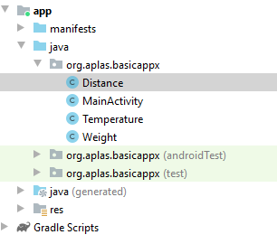
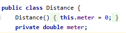
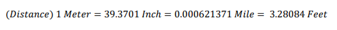
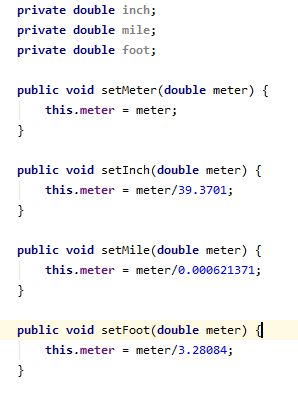
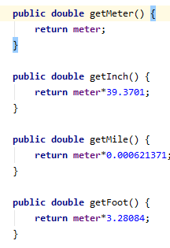
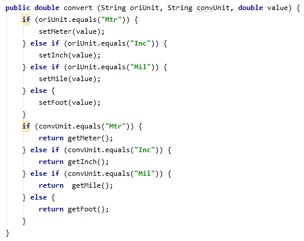
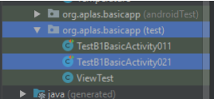
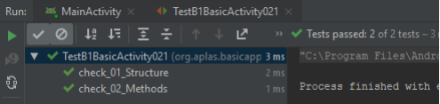

# 02 - Layout ( B1X02 )

## Tujuan Pembelajaran

1. Siswa membuat Distance class untuk mengonversi satuan.

## Hasil Praktikum 

## 1.
Buka proyek BasicAppX yang telah lulus uji.
Buat Distance class baru, terletak di folder yang sama dengan **MainActivity**.

## 2. 
Buat private field dengan nama **“meter”** dan tipe data double.
Lalu buat konstruktor dengan parameter kosong. Inisialisasi konstruktor
**“meter”** dengan nilai 0.

## 3.
Buat tiga set Method untuk **"meter"** dengan mengacu pada rumus ini :

- **“SetMeter”**, dengan 1 double parameter yang langsung ditetapkan ke field **“meter”**.
- **“setInch”**, dengan 1 double parameter yang akan mengkonversi dari **Inch** ke **Meter** dan
tetapkan hasilnya ke kolom **"meter"**.
- **“setMile”**, dengan 1 double parameter yang akan dikonversi dari **Mile** ke **Meter** dan ditetapkan
hasil field nya ke **"meter"**.
- **“setFoot”**, dengan 1 double parameter yang akan dikonversi dari **Foot** ke **Meter** dan ditetapkan
hasil field nya ke **"meter"**.

  

## 4. 
Buat tiga get Method (fungsi) untuk mengembalikan nilai double dari unit konversi
**“meter”**:
- **“getMeter”**, dengan parameter kosong yang langsung mengembalikan field **“meter”**.

- **“getInch”**, dengan parameter kosong yang akan mengubah field **“meter”** dari **Meter**
ke **Inch** dan mengembalikan hasilnya.

- **“getMile”**, dengan parameter kosong yang akan mengubah field **“meter”** dari **Meter** ke **Mile**
dan mengembalikan hasilnya.

- **“getFoot”**, dengan parameter kosong yang akan mengubah field **“meter”** dari **Meter** ke **Foot**
dan mengembalikan hasilnya.

  

## 5. 
Buat method (fungsi) **"konversi"** untuk mengembalikan nilai ganda yang dikonversi dari 
unit (asli) ke yang lain (dikonversi) sebagai nilai pengembalian. Memanfaatkan get dan
mengatur method untuk membuat algoritma dari method ini. Ada 3 parameter:
- String oriUnit, sebagai unit asli (nilai kemungkinannya adalah Mtr, Inc, Mil, Ft).
- KonvUnit string, sebagai unit yang dikonversi (nilai kemungkinannya adalah Mtr, Inc, Mil, Ft).
- nilai ganda, sebagai nilai asli yang akan dikonversi.

  

## 6. 
Copy file **TestA1BasicUIX021.java** ke
Folder **org.aplas.basicappx (test)**

## 7. 
Klik kanan pada file **TestB1BasicActivityX021.java** lalu pilih **Run TestB1BasicUIX021**. Jika berhasil lanjutkan ke langkah berikutnya 

