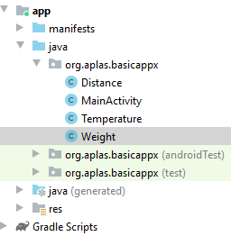
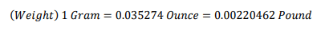
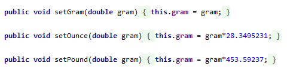
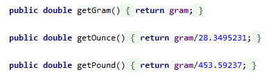
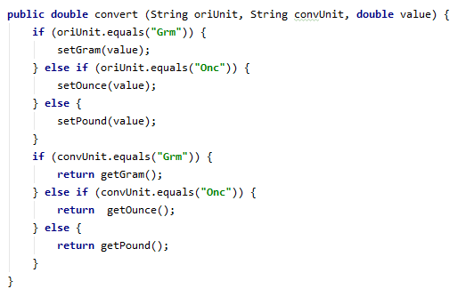
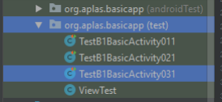

# 02 - Layout ( B1X03 )

## Tujuan Pembelajaran

1. Siswa tahu bagaimana merancang layout, menambahkan TextView, dan menambahkan Button.

## Hasil Praktikum 

## 1.
Buka proyek BasicAppX yang telah lulus uji.
Buat Weight class baru, terletak di folder yang sama dengan **MainActivity**.

## 2. 
Buat private field dengan nama **“gram”** dan tipe data double.
Lalu buat konstruktor dengan parameter kosong. Inisialisasi konstruktor
**“gram”** dengan nilai 0.

## 3.
Buat tiga set Method untuk **"gram"** dengan mengacu pada rumus ini :

- **“SetGram”**, dengan 1 double parameter yang langsung ditetapkan ke field **“gram”**.
- **“setOunce”**, dengan 1 double parameter yang akan mengkonversi dari **Ounce** ke **Gram** dan
tetapkan hasilnya ke kolom **"gram"**.
- **“setPound”**, dengan 1 double parameter yang akan dikonversi dari **Pound** ke **Gram** dan ditetapkan
hasil field nya ke **"gram"**.

  

## 4. 
Buat tiga get Metode (fungsi) untuk mengembalikan nilai double dari unit konversi
**“gram”**:
- **“getGram”**, dengan parameter kosong yang langsung mengembalikan field **“gram”**.

- **“getOune”**, dengan parameter kosong yang akan mengubah field **“gram”** dari **Gram**
ke **Oune** dan mengembalikan hasilnya.

- **“getPound”**, dengan parameter kosong yang akan mengubah field **“gram”** dari **Gram** ke **Pound**
dan mengembalikan hasilnya.

  

## 5. 
Buat method (fungsi) **"konversi"** untuk mengembalikan nilai ganda yang dikonversi dari a
unit (asli) ke yang lain (dikonversi) sebagai nilai pengembalian. Memanfaatkan get dan
mengatur method untuk membuat algoritma dari method ini. Ada 3 parameter:
- String oriUnit, sebagai unit asli (nilai kemungkinannya adalah Grm, Onc, Pnd).
- String konvUnit, sebagai unit yang dikonversi (nilai kemungkinannya adalah Grm, Onc, Pnd).
- nilai ganda, sebagai nilai asli yang akan dikonversi.

## 6. 
Copy **TestA1BasicUIX031.java** ke folder
**org.aplas.basicappx (test)**

## 7. 
Klik kanan pada file **TestB1BasicActivityX031.java** lalu pilih **Run TestB1BasicUIX031**. Jika berhasil lanjutkan ke langkah berikutnya .

