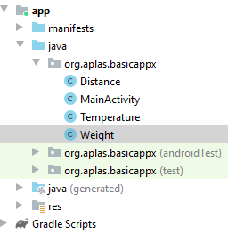
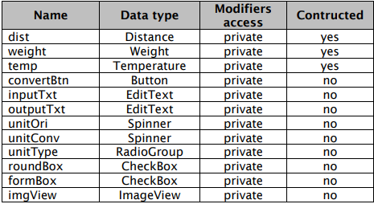
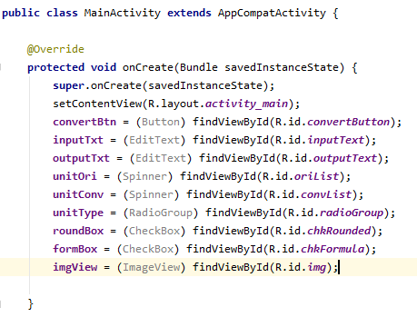
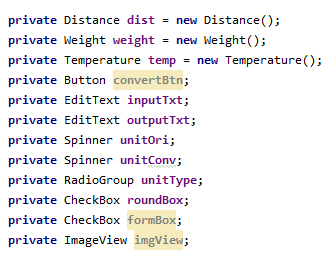
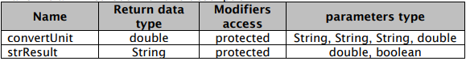
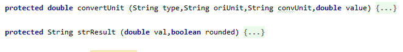
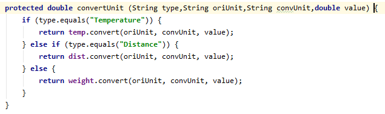
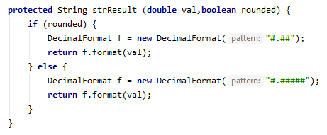
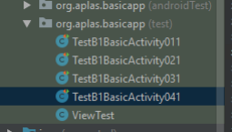
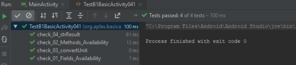

# 02 - Layout ( B1X04 )

## Tujuan Pembelajaran

1. Siswa tahu bagaimana membuat Space dan menambahkan Child Layout.

## Hasil Praktikum 

## 1.
Buka **BasicAppX** Project, lalu 
buka **MainActivity.java**.

## 2. 
Buat beberapa fields dengan deskripsi dibawah ini.

di bawah method **"OnCreate"** buat modifiers nya

## 3.
Buat 2 method kosong dengan deskripsi dibawah ini.

## 4. 
Metode "convertUnit" (fungsi) akan mengembalikan nilai ganda yang dikonversi dari unit (asli) ke yang lain (dikonversi) sebagai nilai pengembalian. Memanfaatkan "konversi" metode di class Suhu, Jarak, dan Berat untuk membuat algoritma method ini. Ada 4 parameter:
- Jenis string, sebagai unit asli (nilai kemungkinan adalah Suhu, Jarak,
Bobot).
- String oriUnit, sebagai unit asli (nilai kemungkinannya adalah ° C, ° F, K, Mtr, Inc, Mil, Ft,
Grm, Pnd, Onc).
- KonvUnit string, sebagai unit yang dikonversi (nilai kemungkinan adalah ° C, ° F, K, Mtr, Inc,
Mil, Ft, Grm, Pnd, Onc).
- nilai double, sebagai nilai asli yang akan dikonversikan.

  

## 5. 
Metode "strResult" (fungsi) akan mengembalikan nilai String dari nilai double di
parameter. Ada 2 parameter:
- double val, sebagai nilai asli yang akan diubah menjadi string.
- Boolean Rounded, sebagai indikator. Jika benar, hasilnya harus berupa nilai yang dibulatkan
dengan hanya 2 digit setelah desimal. Jika salah berarti tidak ada proses pembulatan.

  

## 6. 
Copy **TestA1BasicUIX041.java** ke folder
**org.aplas.basicappx (test)**

## 7. 
Klik kanan pada file **TestB1BasicActivityX041.java** lalu pilih **Run TestB1BasicUIX041**. Jika berhasil lanjutkan ke langkah berikutnya . 

