# 05 - Sccrolling Text

## Tujuan Pembelajaran

1. Cara menggunakan kode XML untuk menambahkan banyak TextViewelemen.
2. Cara menggunakan kode XML untuk menentukan pengguliran View.
3. Cara menampilkan teks bentuk bebas dengan beberapa tag pemformatan HTML.
4. Bagaimana memberi gaya pada TextViewwarna latar belakang dan warna teks.
5. Bagaimana cara memasukkan tautan web ke dalam teks.

## Hasil Praktikum

# Task 1: Add and edit TextView elements

## A. Create the project and TextView elements

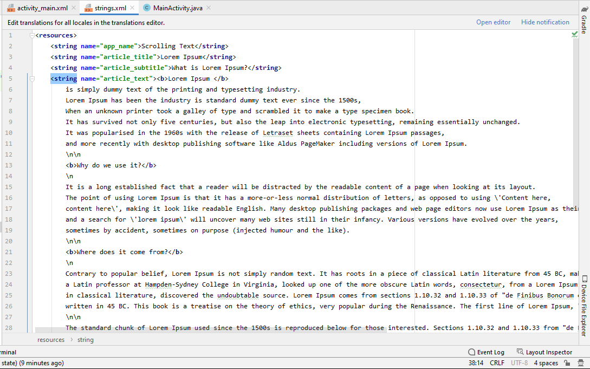
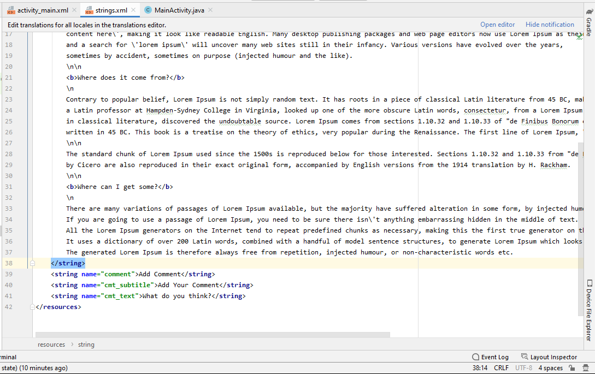

## B. Add the text of the article

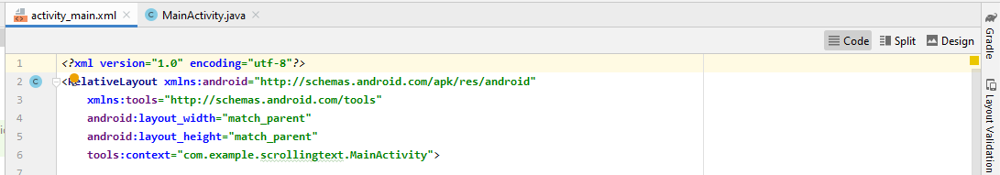
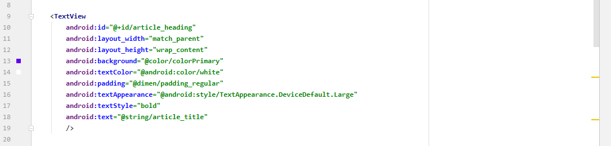
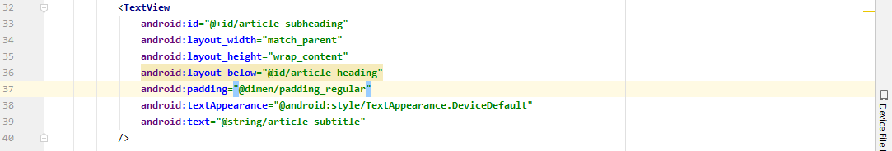
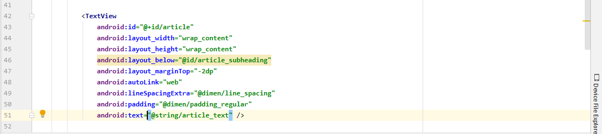
## _____________________________________________________________________________
# Task 2: Add a ScrollView and an active web link

## A. Add the autoLink attribute for active web links

## B. Add a ScrollView to the layout

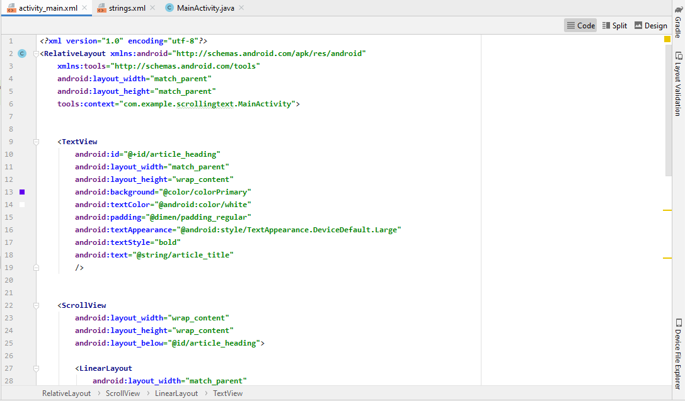
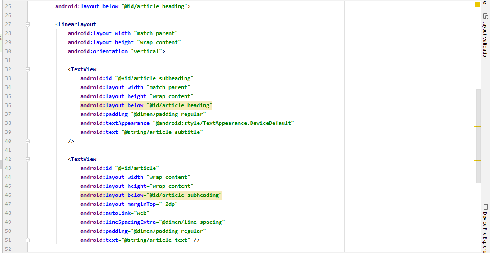

## C. Add a LinearLayout to the ScrollView

## _____________________________________________________________________________
# Hasil Run APP
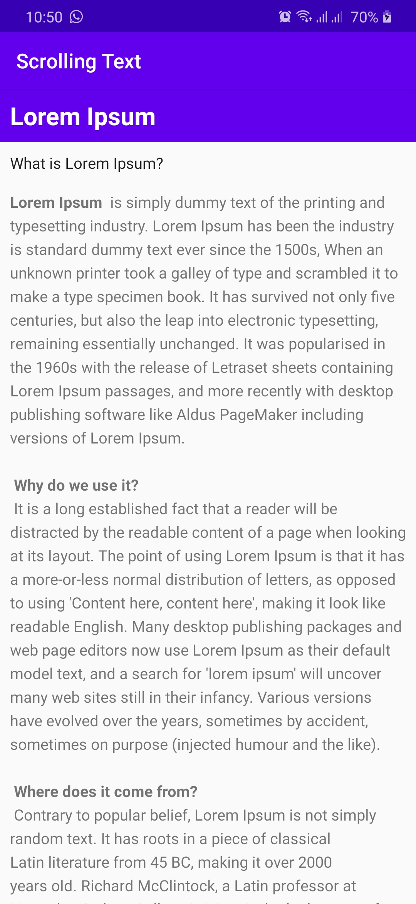

## _____________________________________________________________________________
# Challenge

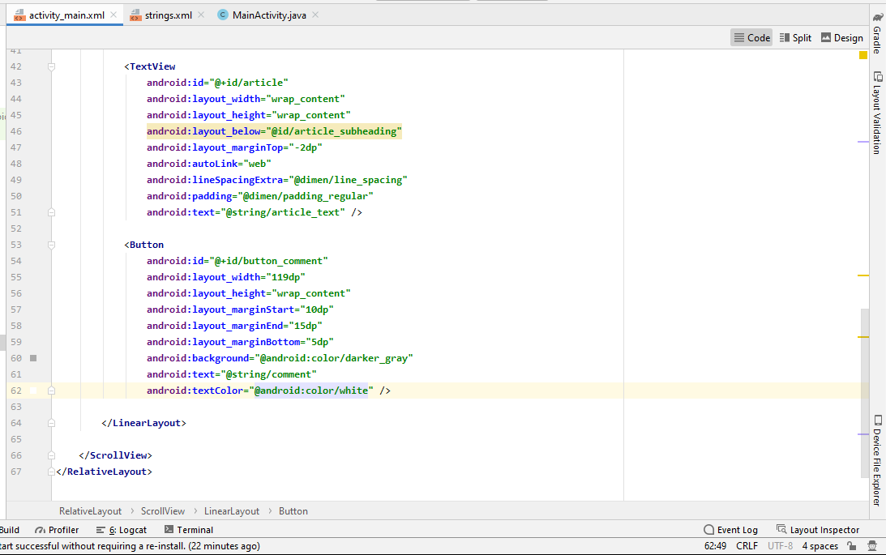
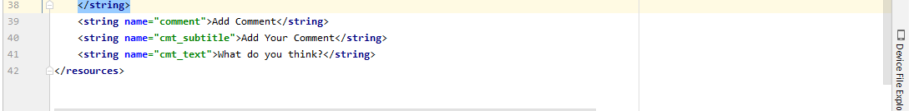
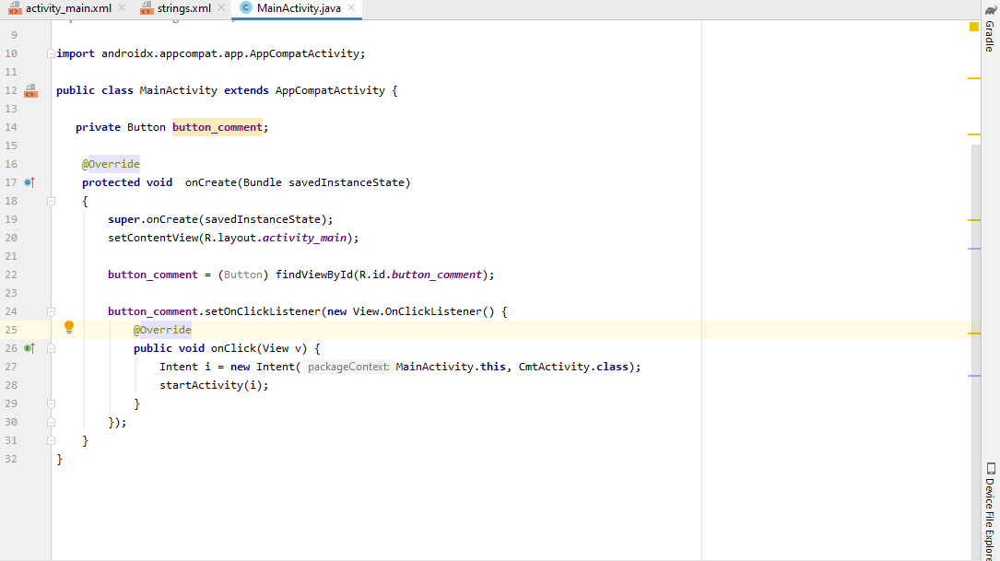

# Hasil Run APP Challenge
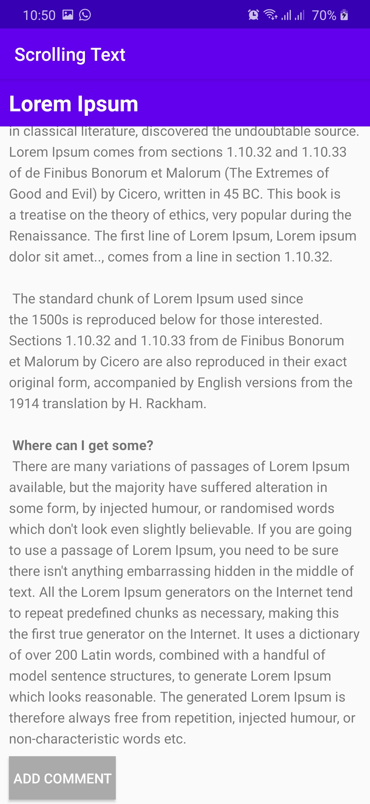