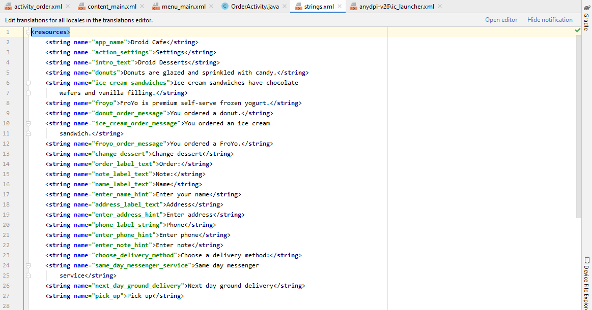
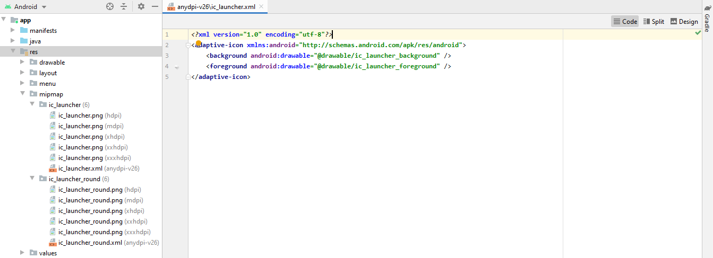
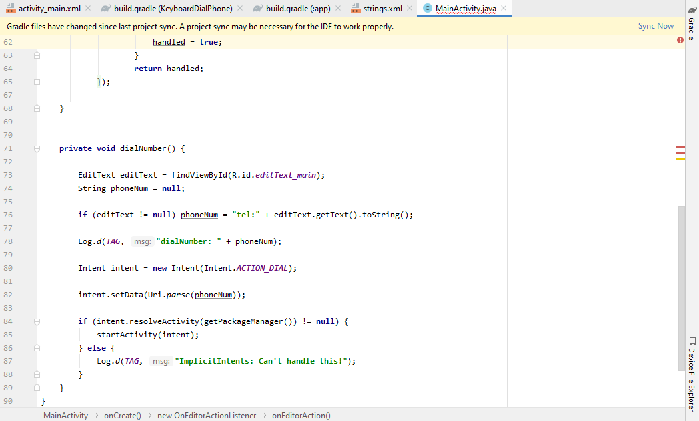

# 06 - Input Control

## Tujuan Pembelajaran

1. How to change the input methods to enable suggestions, auto-capitalization, and password obfuscation.
2. How to change the generic on-screen keyboard to a phone keypad or other specialized keyboards.
3. How to add radio buttons for the user to select one item from a set of items.
4. How to add a spinner to show a drop-down menu with values, from which the user can select one.

## Hasil Praktikum

# activity_order

# OrderActivity

# strings

# content_main

# activity_main

# menu_main

# ic_launcher

## Hasil Run APP

## Challenge

# Hasil Run APP Challenge

