# 08 - Data Binding

## Tujuan Pembelajaran

1. Cara mengonversi aplikasi ini ke Data Binding

## Hasil Praktikum
# __________________________________________________________
## plain_activity

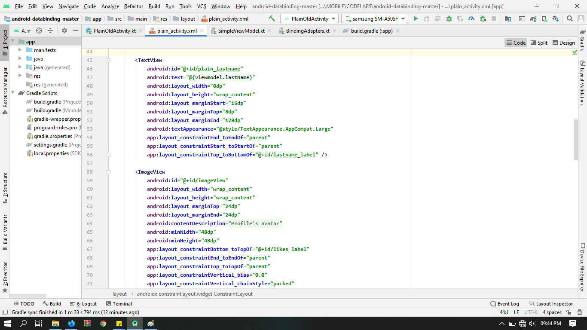
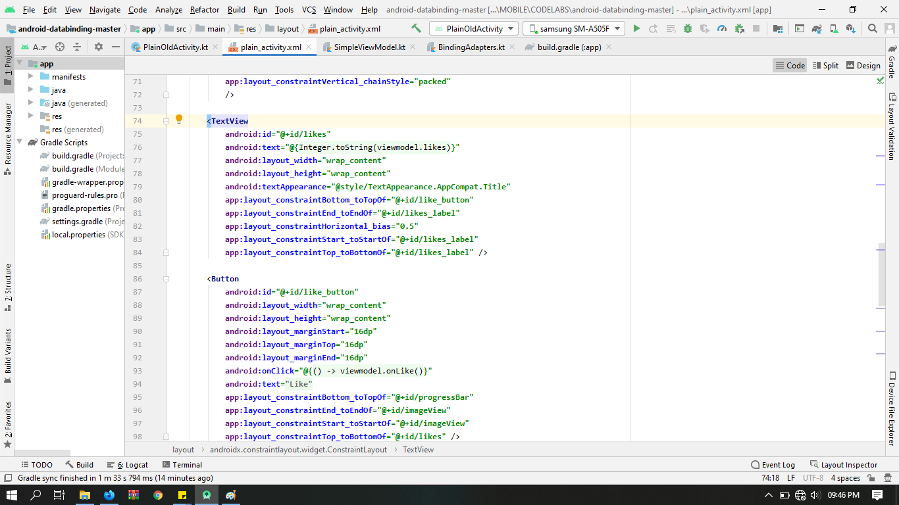
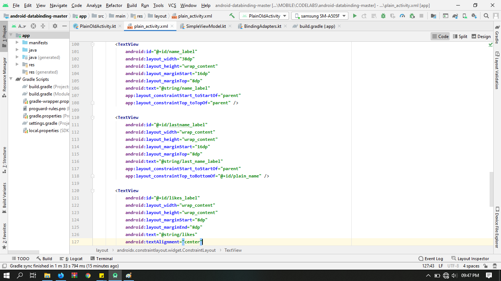
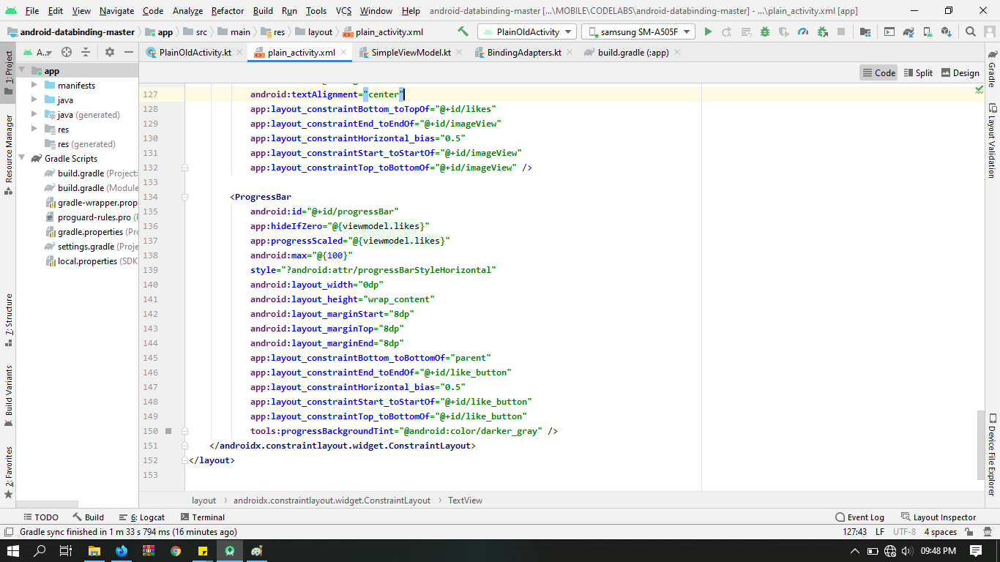

# __________________________________________________________
## BindingAdapter

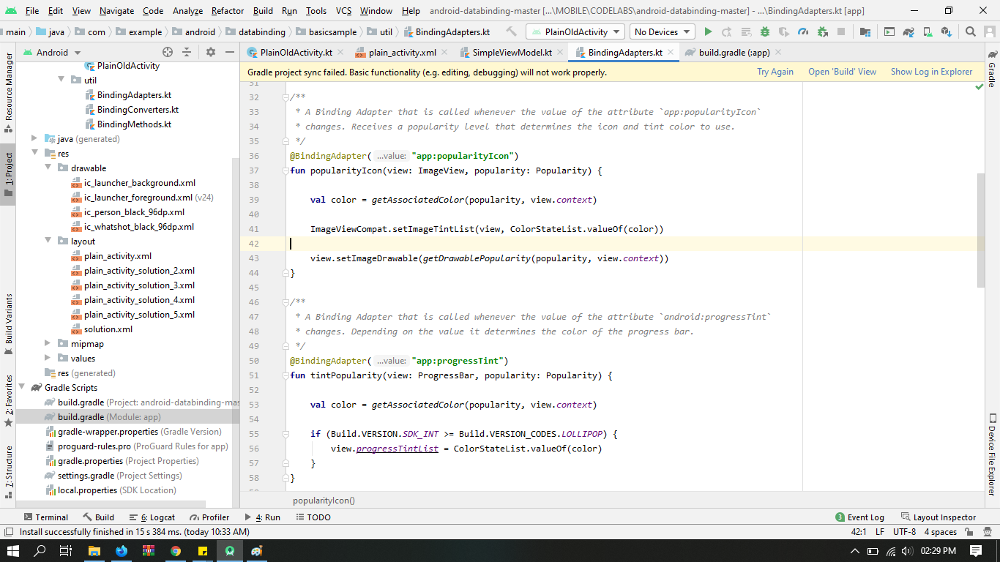
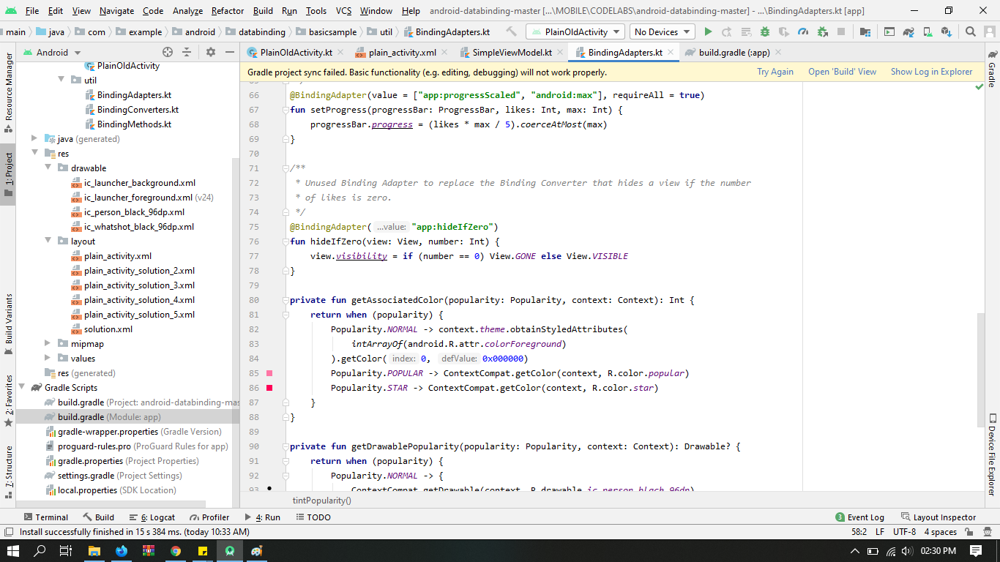
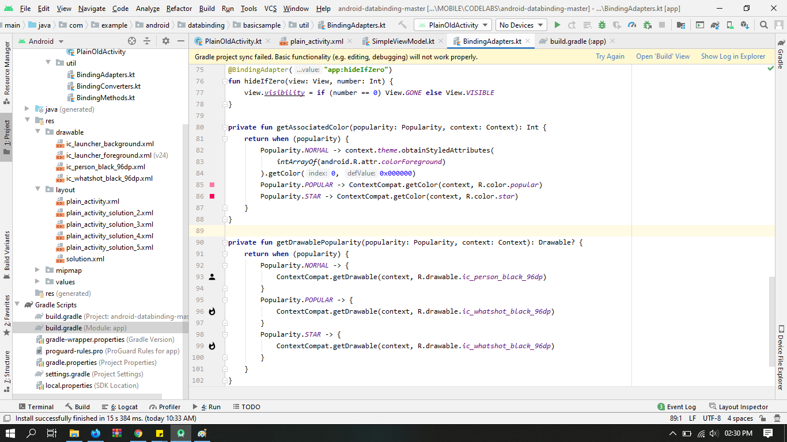

# __________________________________________________________
## PlainOldActivity

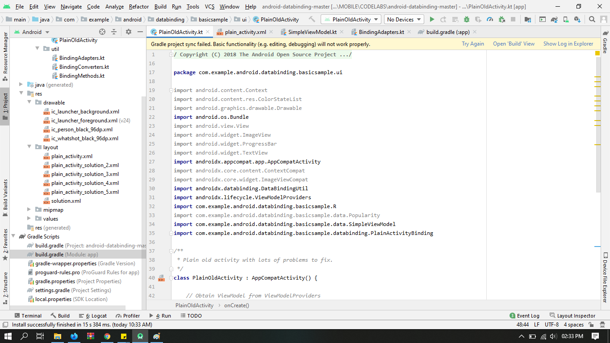
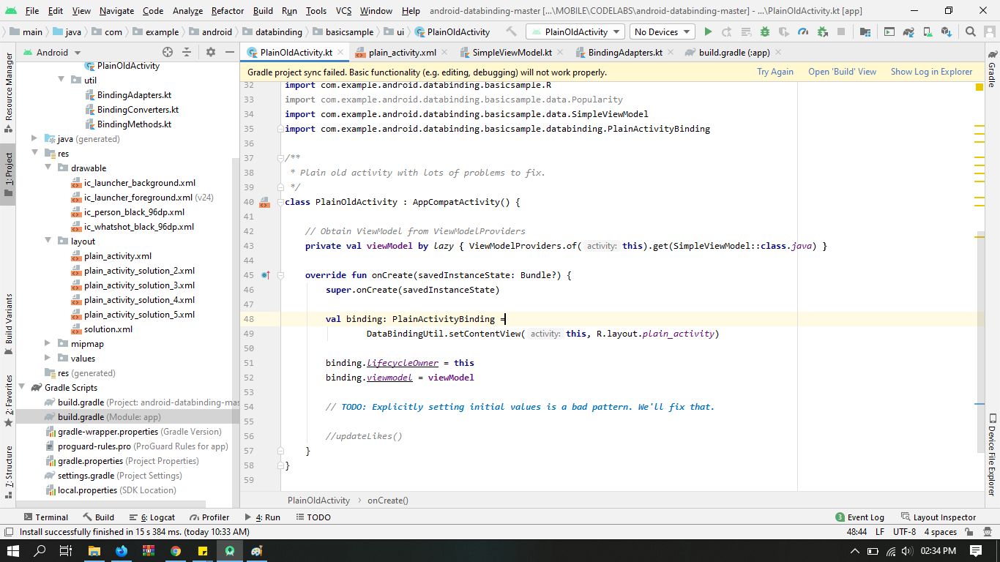

# __________________________________________________________
## BuildGradle

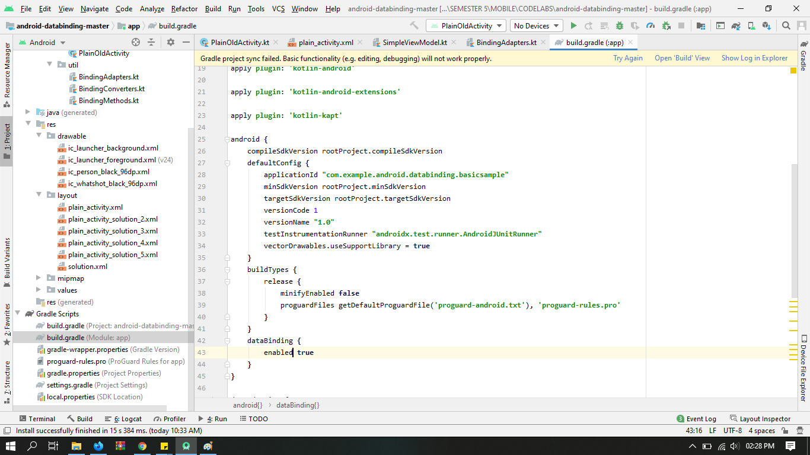

# __________________________________________________________
## ViewModel

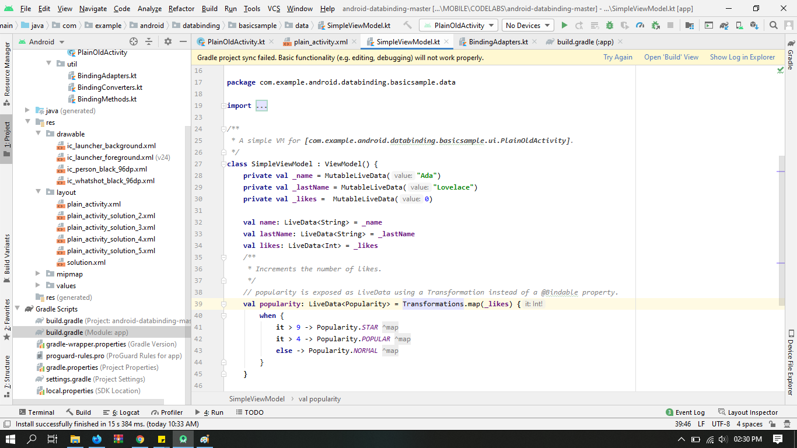
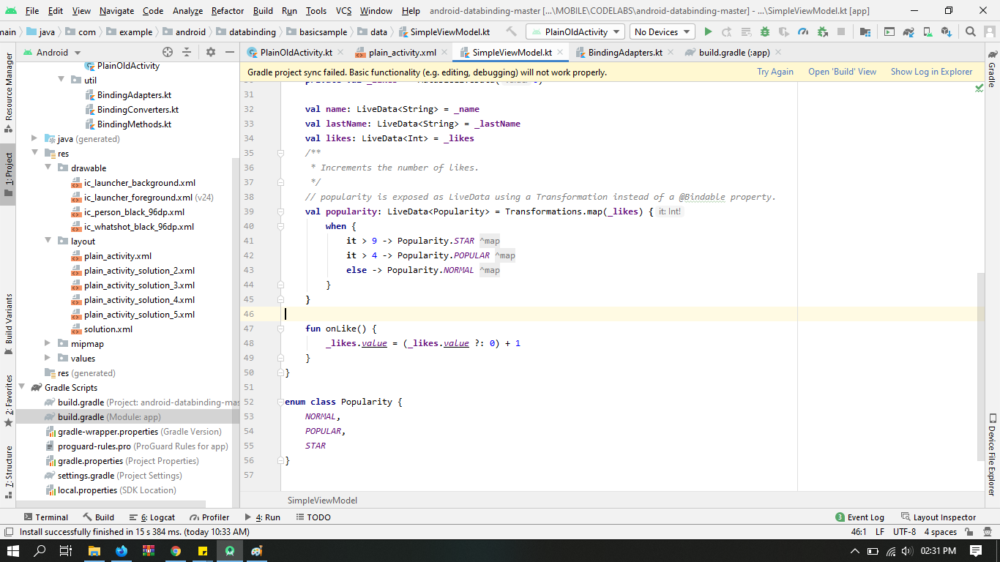

# __________________________________________________________
## Challenge

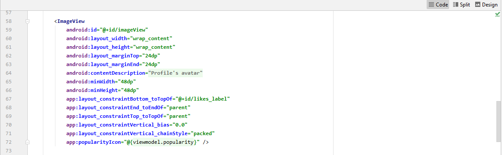

# Hasil Run APP Challenge
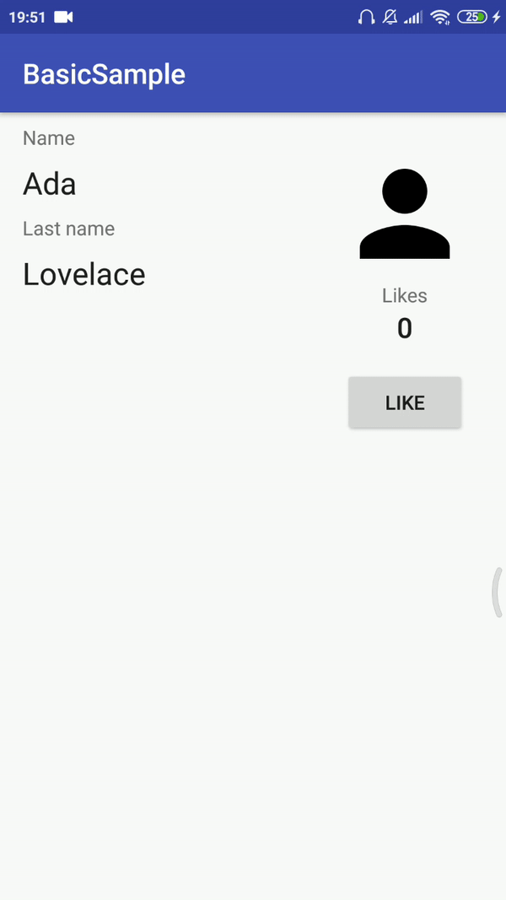
=