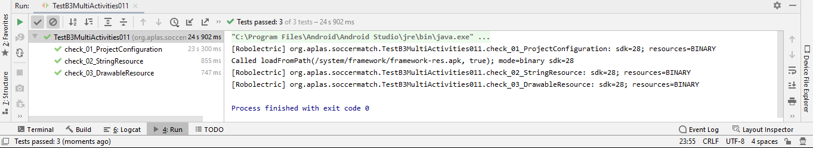
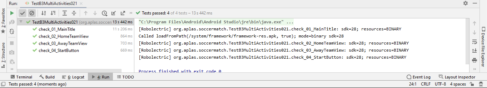
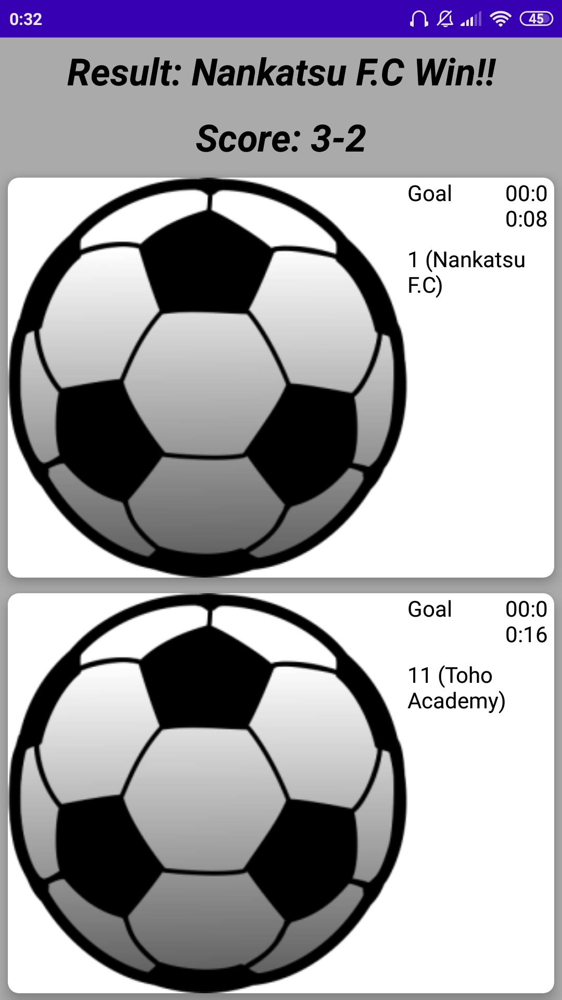

# 10 - ScoreMatch B3

## Tujuan Pembelajaran

1. How to create anAndroid applicationthat contains several activities entitled Soccer Match. First with project configuration and resource configuration.
2. How to design the Main layout as first layout that contains CardView, ListView, ImageButton, TextView, EditText, and Button.
3. How to to design the Playlayoutas secondlayout that contains CardView, ImageButton, ImageView,TextView, FragmentContainer, and Button.
4. How to design the Loglayoutas thirdlayout that contains TextView, RecyclerView, and Button.
5. How to design the layout of list, layout of dialog, layout of match log, and layout of footer fragment.
6. How to handle ListView, open image selector intent, show a dialog, and go to another intent.
7. How to gather Intent passing variables, use Timer with Handler, use Popup Menu and create and access Fragment.

## Hasil Praktikum

# TASK B3.01

# TASK B3.02

# TASK B3.03

# TASK B3.04

# TASK B3.05

# TASK B3.06

# TASK B3.07

# TASK B3.08

# Hasil Run APP

