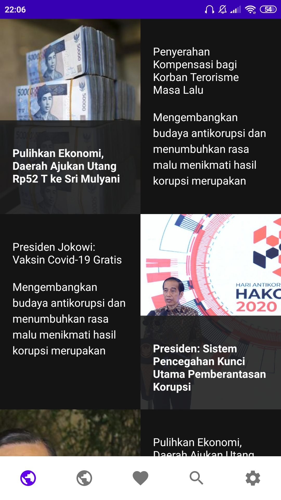
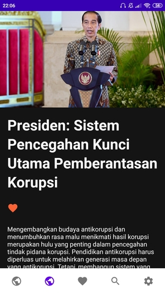
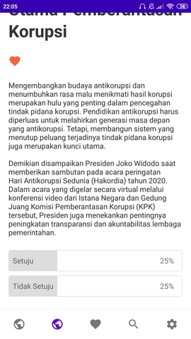
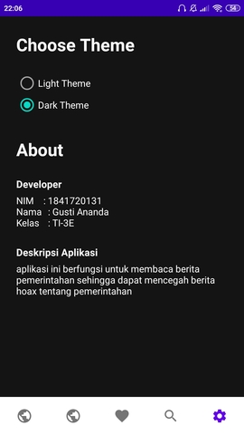

# Judul / Nama Aplikasi

Judul Aplikasi : Suara Rakyat

Link src    : https://github.com/nandadesu/mobile-3e-13/tree/master/src/11_UAS

Bahasa Pemrograman  : Java

# Deskripsi Aplikasi
aplikasi ini berfungsi untuk membaca berita pemerintahan sehingga dapat
mencegah berita hoax tentang pemerintahan

# Indentitas Pengembang (Developer)
NIM     : 1841720131

Nama    : Gusti Ananda

Kelas   : TI-3E

# Fitur-fitur Aplikasi

## Home Dark

## Detail Dark

## Poling

## Setting & About Dark

# Saran
Dalam aplikasi ini masih ada beberapa fitur yang belum selesai, yaitu fitur bookmark, search, login, register, polling system

# Kesimpulan

Selama saya merancang aplikasi ini, saya belajar banyak bagaimana caranya membuat layout, membuat button, memasukkan data,dll

# Sumber Data/Referensi
https://www.setneg.go.id/

