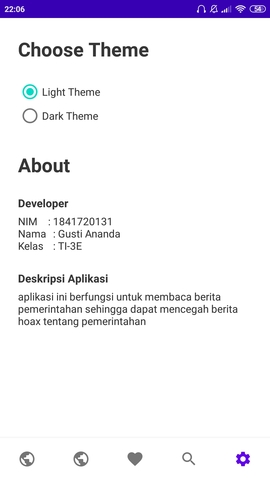

# Judul / Nama Aplikasi

Judul Aplikasi : Suara Rakyat

Link src    :

Bahasa Pemrograman  : Java

# Deskripsi Aplikasi
aplikasi ini berfungsi untuk membaca berita pemerintahan sehingga dapat
mencegah berita hoax tentang pemerintahan

# Indentitas Pengembang (Developer)
NIM     : 1841720131

Nama    : Gusti Ananda

Kelas   : TI-3E

# Fitur-fitur Aplikasi

## Home Light

## Detail Light

## Poling

## Setting & About Light

(Jelaskan fitur-fitur yang ada pada Aplikasi Anda beserta screenshot layar, termasuk mulai
dari splash screen – jika ada; sampai menu About atau Informasi)

# Saran
Dalam aplikasi ini masih ada beberapa fitur yang belum selesai, yaitu fitur bookmark, search, login, register, polling system

# Kesimpulan

Selama saya merancang aplikasi ini, saya belajar banyak bagaimana caranya membuat layout, membuat button, memasukkan data,dll

# Sumber Data/Referensi
(cantumkan sumber data untuk konten aplikasi Anda di sini, jika perlu cantumkan juga
sumber belajar Anda selama proses pengembangan aplikasi Anda)

