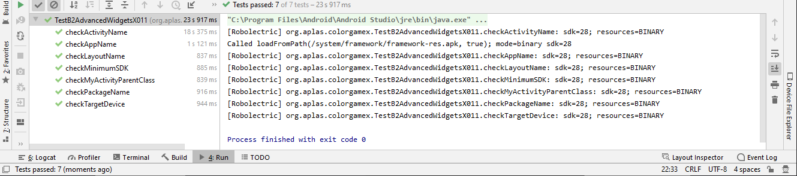
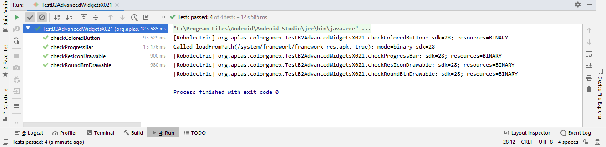
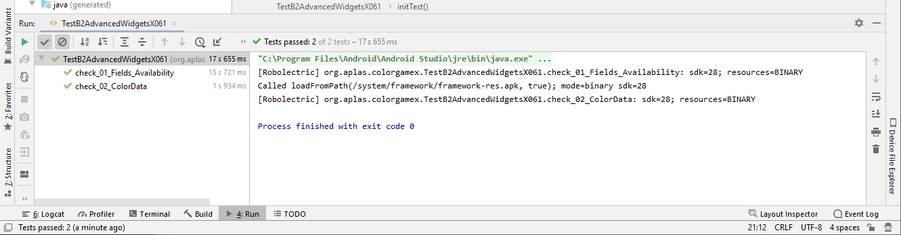
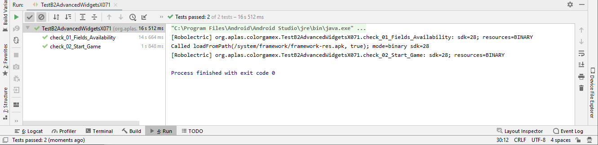

# 4 - Advanced Widget

## Tujuan Pembelajaran

1. Cara membuat aplikasi Android game sederhana. Pertama dengan konfigurasi proyek dan konfigurasi resource.
2. Memahami tentang gaya, tema, dan gambar vektor yang dapat digambar.
3. Cara membuat UI untuk proyek Color Game dengan beberapa atribut onClick.
4. Bagaimana mendeklarasikan field yang dibutuhkan oleh aplikasi dan menentukan metode untuk memeriksa validitas untuk memasuki game.
5. Bagaimana memahami cara kerja Countdowntimer.
6. Cara mengakses array dari resource dan memasukkannya ke dalam List dan Hashtable.
7. Cara memulai timer untuk memulai permainan.
8. Bagaimana menangani pengatur waktu dan menghitung skor.

## Hasil Praktikum
## _____________________________________________________________________________
# TASK GUIDE (B2X.011 & B2X.012)

Cara membuat aplikasi Android game sederhana. Pertama dengan konfigurasi proyek dan konfigurasi resource.

## _____________________________________________________________________________
# TASK GUIDE (B2X.021)

Memahami tentang gaya, tema, dan gambar vektor yang dapat digambar.

## _____________________________________________________________________________
# TASK GUIDE (B2X.031)

Cara membuat UI untuk proyek Color Game dengan beberapa atribut onClick.

## _____________________________________________________________________________
# TASK GUIDE (B2X.041)

Bagaimana mendeklarasikan field yang dibutuhkan oleh aplikasi dan menentukan metode untuk memeriksa validitas untuk memasuki game.

## _____________________________________________________________________________
# TASK GUIDE (B2X.051)

Bagaimana memahami cara kerja Countdowntimer.

## _____________________________________________________________________________
# TASK GUIDE (B2X.061)

Cara mengakses array dari resource dan memasukkannya ke dalam List dan Hashtable.

## _____________________________________________________________________________
# TASK GUIDE (B2X.071)

Cara memulai timer untuk memulai game.

## _____________________________________________________________________________
# TASK GUIDE (B2X.081)

Bagaimana menangani pengatur waktu dan menghitung skor.

