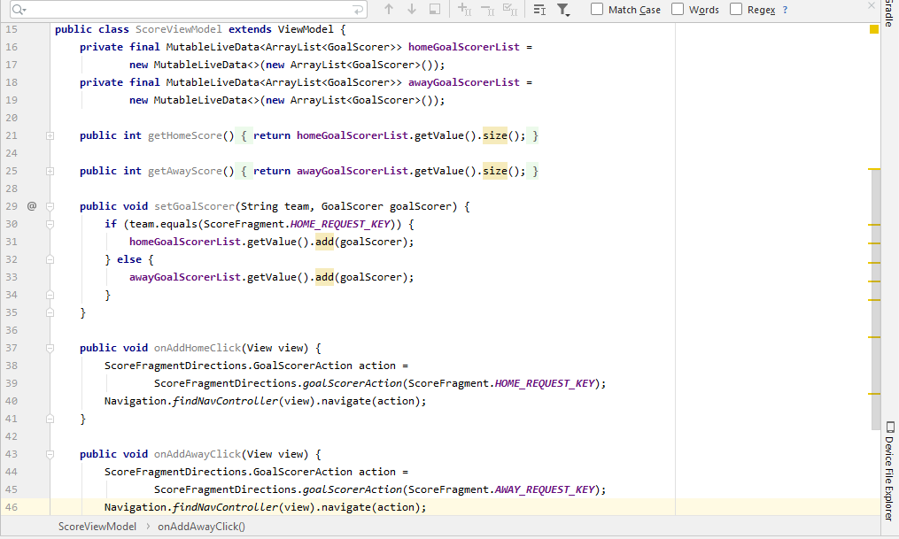
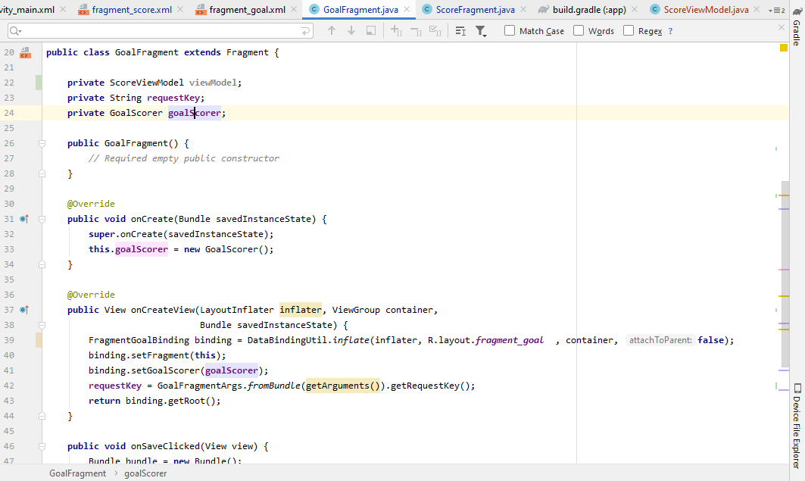
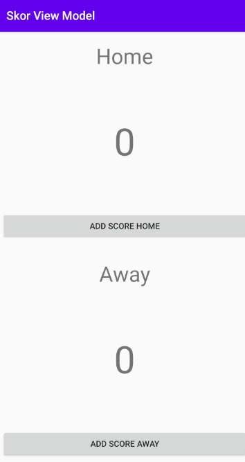
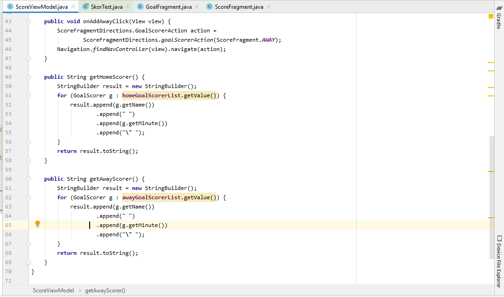
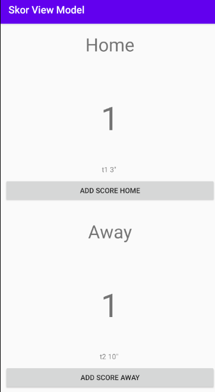

# 09 - View Model

## Tujuan Pembelajaran

1. Mahasiswa mengenal tentang arsitektur MVVM.
2. Mahasiswa memahami lifecycle viewmodel pada MVVM.
3. Mahasiswa mampu menerapkan viewmodel pada Android.

## Hasil Praktikum

# ScoreViewModel

# ScoreFragment

# GoalFragment

# Hasil Run APP

## Challenge

# Hasil Run APP Challenge

